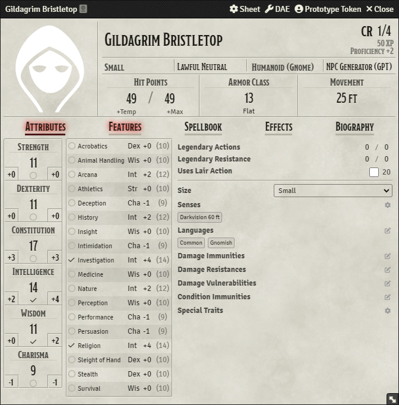

# NPC Generator (GPT) for D&D 5e
This Foundry VTT module allows users to generate random NPCs using the [BetterChatGPT](https://github.com/ztjhz/BetterChatGPT) APIs.

##

## Setup
To install, follow these instructions:
1. Inside Foundry, select the Game Modules tab in the Configuration and Setup menu.
1. Click the Install Module button and enter the following URL: https://github.com/Halftonex/npc-generator-gpt/releases/latest/download/module.json
1. Click Install and wait for installation to complete.

## Limitations
Since this module uses a free API endpoint, some requests might be rejected due to high demand, just wait a bit and try again. As an alternative, you can use your private API key to communicate directly with OpenAI's API.

## Usage
After installing and enabling the module, you will find a new button on top of the Actors tab.

After pressing the button, a window will open allowing you to select certain parameters.

 

Here's an example of an NPC created with this module.

## Settings

## Report a bug
For any issues, requests and bug reporting, you can dm me on discord @half.tone or visit the project's Github issue page [here](https://github.com/Halftonex/npc-generator-gpt/issues).

## Licence
This Foundry VTT module is licensed under a [Creative Commons Attribution 4.0 International License](https://creativecommons.org/licenses/by/4.0/).
