# NPC Generator (GPT) for D&D 5e
This Foundry VTT module allows users to generate random NPCs using ChatGPT APIs.

##
![Dynamic JSON Badge](https://img.shields.io/badge/dynamic/json?url=https%3A%2F%2Fgithub.com%2FHalftonex%2Fnpc-generator-gpt%2Freleases%2Flatest%2Fdownload%2Fmodule.json&query=compatibility.minimum&logo=data%3Aimage%2Fsvg%2Bxml%3Bbase64%2CPHN2ZyB4bWxucz0iaHR0cDovL3d3dy53My5vcmcvMjAwMC9zdmciIHZlcnNpb249IjEiIHdpZHRoPSIxMDAiIGhlaWdodD0iMTAwIj4NCjxwYXRoIGQ9Ik05MC42LDczLjRMOTAuNiw3My40VjI3bDAsMGMwLDAsMC0wLjEsMC0wLjJzMC0wLjEsMC0wLjJsLTAuMS0wLjFjMC0wLjEsMC0wLjEtMC4xLTAuMmMwLDAsMC0wLjEtMC4xLTAuMQ0KCWMwLTAuMS0wLjEtMC4xLTAuMS0wLjJsLTAuMSwwTDkwLDI1LjlsMCwwTDUwLjcsMy43bDAsMGgtMC4xbDAsMGgtMC4xaC0wLjFjLTAuMSwwLTAuMiwwLTAuMywwbDAsMGMtMC4xLDAtMC4yLDAtMC4zLDBoLTAuMWgtMC4xDQoJbDAsMGgtMC4xbDAsMEwxMC4yLDI1LjlsMCwwTDEwLjEsMjZsLTAuMiwwLjFsLTAuMSwwLjFsLTAuMSwwLjFjMCwwLDAsMC4xLTAuMSwwLjJzMCwwLjEtMC4xLDAuMnMwLDAuMSwwLDAuMmMwLDAsMCwwLjEsMCwwLjJsMCwwDQoJdjQ2LjRsMCwwYzAsMCwwLDAsMCwwLjFzMCwwLjEsMCwwLjJzMCwwLjEsMCwwLjJ2MC4xdjAuMWwwLjEsMC4xYzAsMCwwLDAuMSwwLjEsMC4xbDAuMSwwLjFsMC4xLDAuMWwwLjEsMC4xbDAsMGwzOS41LDIxLjFoMC4xDQoJbDAuMiwwLjFINTBoMC4xaDAuMmgwLjJsMC4yLTAuMWgwLjFMOTAsNzQuNGwwLDBsMC4xLTAuMWwwLjEtMC4xbDAuMS0wLjFsMC4xLTAuMWwwLjEtMC4xdi0wLjFjMCwwLDAtMC4xLDAuMS0wLjENCgljMC0wLjEsMC0wLjEsMC0wLjJTOTAuNiw3My40LDkwLjYsNzMuNGMwLTAuMSwwLTAuMSwwLTAuMkw5MC42LDczLjR6IE01MS4zLDkyLjZ2LTguN2wyOC45LTcuMUw1MS4zLDkyLjZ6IE0xOS45LDc2LjlMNDguOCw4NHY4LjcNCglMMTkuOSw3Ni45eiBNMTMuMywyN0w0My41LDkuOWwtMjEsMjIuNGwtMi43LTEuNkwxMy4zLDI3eiBNODguMSw2NC45bC05LjItMzAuNWw5LjItNS4zVjY0Ljl6IE00Ny42LDgxLjFsLTM1LjItOC42bDEwLjctMzUuNA0KCUw0Ny42LDgxLjF6IE03NS4yLDM1LjFMNTAuMSw4MC40TDI0LjksMzUuMUg3NS4yeiBNMjUuNywzMi42bDI0LjQtMjZsMjQuNCwyNi4xTDI1LjcsMzIuNnogTTUyLjYsODEuMWwyNC40LTQ0bDEwLjcsMzUuNGwtMzAuOSw3LjYNCglMNTIuNiw4MS4xeiBNNzcuNiwzMi4zbC0yMS0yMi40TDg2LjgsMjdMNzcuNiwzMi4zeiBNMjEuMywzNC41bC05LjIsMzAuNFYyOS4xTDIxLjMsMzQuNXoiIGZpbGw9IiNmMjdlNDAiLz4NCjxwYXRoIGQ9Ik02Ni40LDEwMy43IiBmaWxsPSIjZjI3ZTQwIi8%2BDQo8L3N2Zz4%3D&logoColor=yellow&label=Foundry%20Version&color=orange)

## Setup
To install, follow these instructions:
1. Inside Foundry, select the Game Modules tab in the Configuration and Setup menu.
1. Click the Install Module button and enter the following URL: https://github.com/Halftonex/npc-generator-gpt/releases/latest/download/module.json
1. Click Install and wait for installation to complete.

## Usage
1. Go to https://platform.openai.com/account/api-keys
1. If you don't already have one, create a new account.
1. Generate a new secret key.
1. Open the module settings.
1. Paste your secret key in the "Api Key" field.
   
---

**N.B.** 
*OpenAI's APIs are not free, although, given their limited usage by the module, they are very cost-effective. The average cost per generation is about $0.001. You can find the exact generation cost as log in the console (F12).*

*To check your available credit, please visit the following address:* https://platform.openai.com/account/billing/overview

---

### Generate
After installing and enabling the module, you will find a new button on top of the Actors tab.

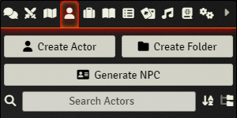

After pressing the button, a window will open allowing you to select certain parameters.

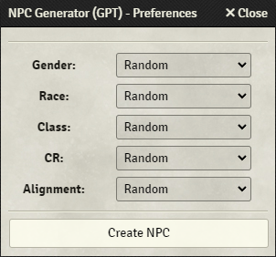 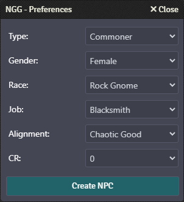

Here's an example of an NPC created with this module.

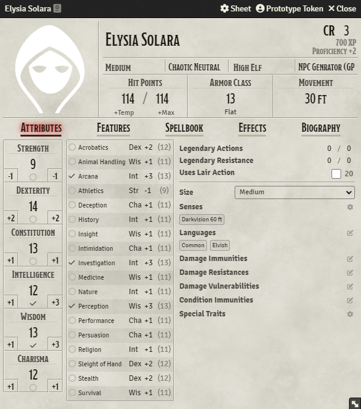

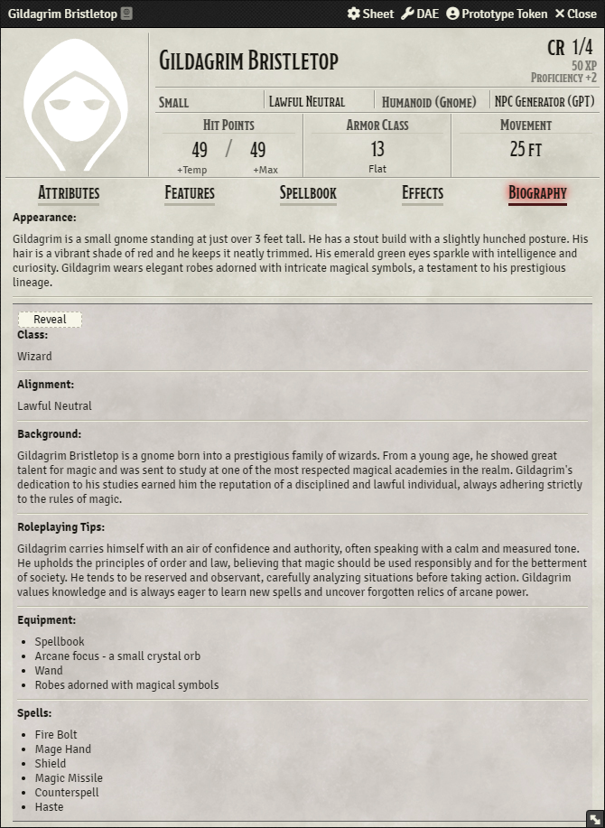

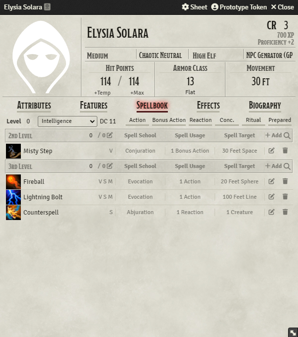

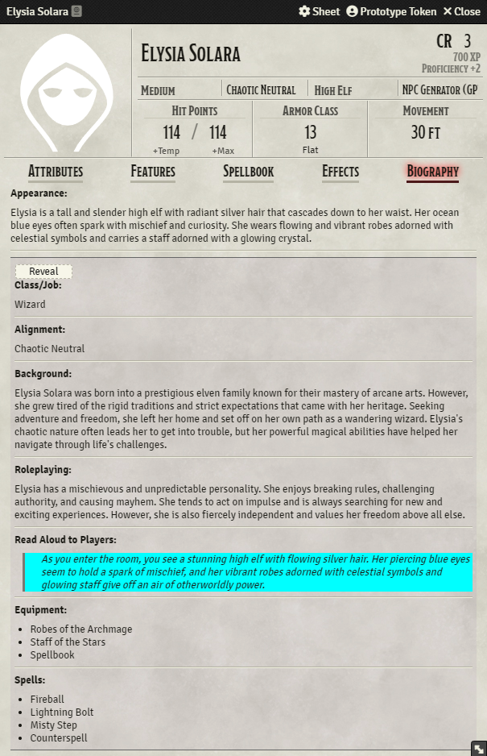

---

### Enhance
You will also find a new button on the NPC character sheet, this button will let you scale an existing NPC to a desired CR.

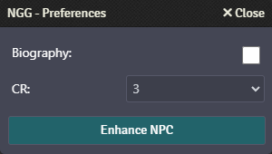

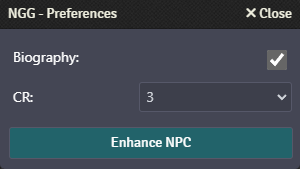

Before

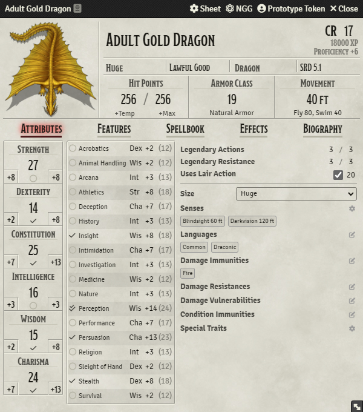

After

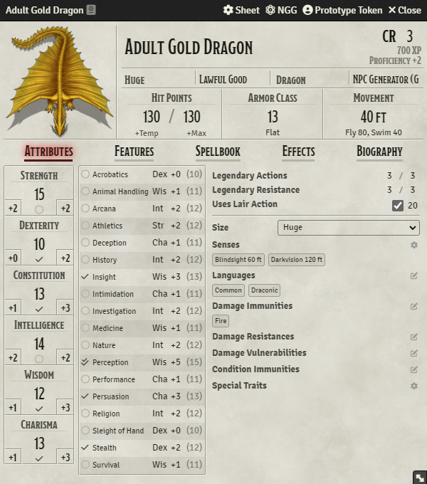

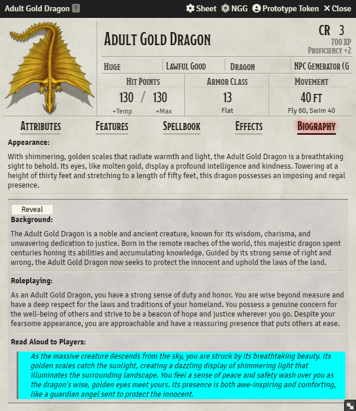

## Settings
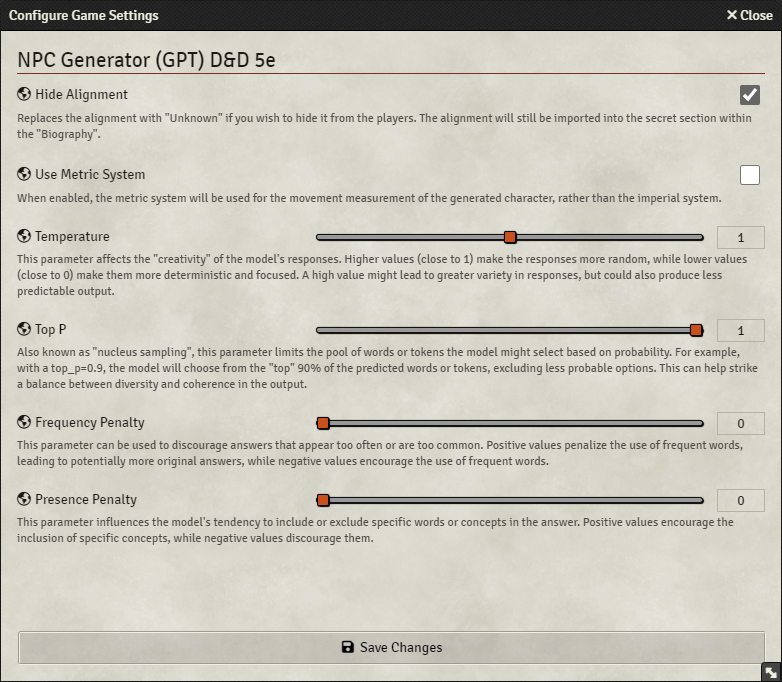

## Support
For any issues, requests and bug reporting, you can dm me on discord @half.tone or visit the project's Github issue page [here](https://github.com/Halftonex/npc-generator-gpt/issues).

## Licence
This Foundry VTT module is licensed under a [Creative Commons Attribution 4.0 International License](https://creativecommons.org/licenses/by/4.0/).
